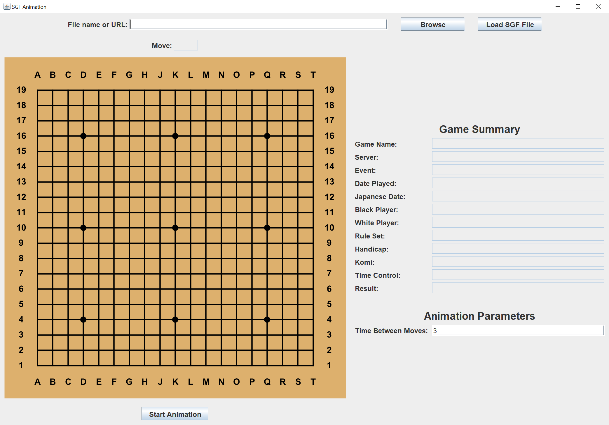
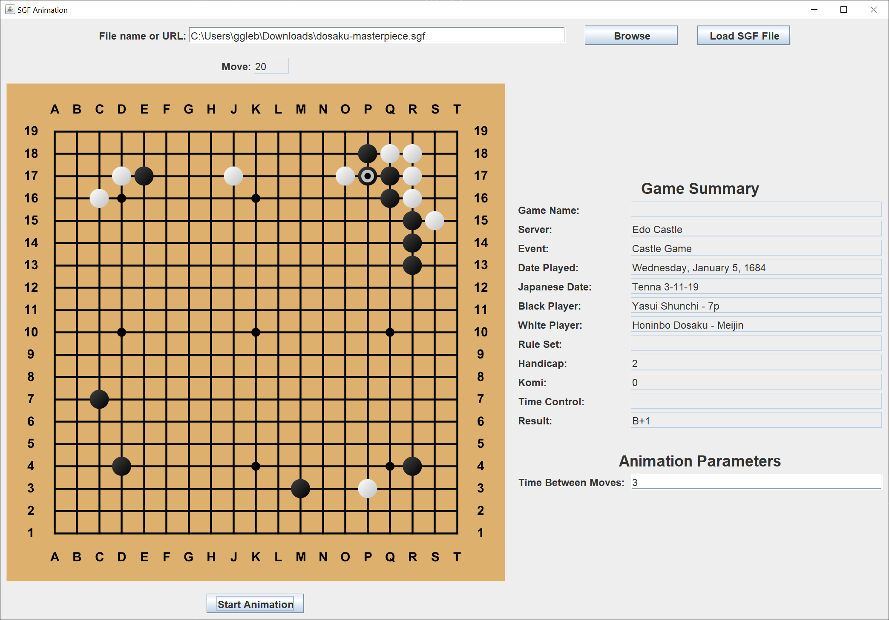

# SGF Animation

## Introduction

SGF is an acronym for "Simple game format".  This game format was first developed for the [game of Go](https://en.wikipedia.org/wiki/Go_(game)), and later extended to encompase other board games.  Here's the [official specification of the SGF format](https://www.red-bean.com/sgf/).

I thought it would be an interesting project to create a Java Swing GUI to animate an SGF Go game file.  In other words, play though a game at a steady pace to allow a person to appreciate or comment on the moves of a particular game.

I encountered one major problem.  SGF files from various Go servers vary wildly in their actual format.

This is an unfinished project at this time.

Here's the Swing GUI when you start the application.

The first step is to either browse your hard drive for a specific SGF file, or type in a URL that points to an SGF file.

Next, you left click on the "Load SGF file" button to load and parse the SGF file.  You can also change the time between moves (in seconds) to whatever value you want.  The shortest value is 3 seconds.

Finally, you left click on the "Start Animation" button to start the animation.  When the animation is running, you can left click on the "Pause Animation" button to pause the animation.

Here's the Swing GUI after a few moves have been played.

I have included the two SGF files that I tested this Java application with.  I make no assurances that this code will work with any other SGF file.

## Explantion

Oracle has a helpful tutorial, [Creating a GUI With Swing](https://docs.oracle.com/javase/tutorial/uiswing/index.html).  Skip the Learning Swing with the NetBeans IDE section.  

When I create a Swing GUI, I use the [model-view-controller](https://en.wikipedia.org/wiki/Model%E2%80%93view%E2%80%93controller) (MVC) pattern. This pattern allows me to separate my concerns and focus on one part of the application at a time.

A Swing model consists of one or more plain Java getter/setter classes.

A Swing view consists of one `JFrame` and as many `JPanels` and `JDialogs` as you need.

Each Swing `Action` or `Listener` is its own controller. There's usually not one controller to "rule them all".

This Java Swing application contains a parser and a parser model as well as the Swing model, view, and controllers.

